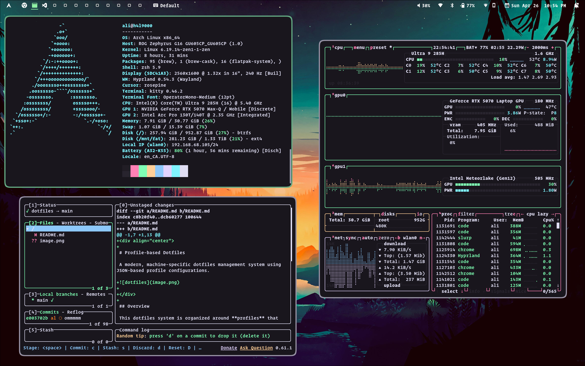

<div align="center">

# Profile-based Dotfiles

A modern, machine-specific dotfiles management system using JSON-based profile configurations.



</div>

## Overview

This dotfiles system is organized around **profiles** that represent specific computer/OS combinations. Each profile contains its own package lists, configuration files, and setup scripts tailored to that specific environment.

## Available Profiles

| Profile           | Description                            | OS      | Architecture |
| ----------------- | -------------------------------------- | ------- | ------------ |
| `discobot-darwin` | Mac laptop running macOS               | macOS   | ARM64        |
| `h4l9000-arch`    | ROG G16 laptop running Arch Linux      | Arch    | x86_64       |
| `k3v1n-arch`      | Minisforum V3 running Arch Linux       | Arch    | x86_64       |
| `mcu-arch`        | Desktop workstation running Arch Linux | Arch    | x86_64       |
| `mcu-win`         | Desktop workstation running Windows    | Windows | x86_64       |
| `nullsector-deb`  | Debian headless CLI box                | Debian  | x86_64       |
| `zero-deb`        | Debian home server                     | Debian  | x86_64       |

## Quick Start

### Auto-detection (Recommended)

```bash
./install.sh --auto
```

### Manual Profile Selection

```bash
# List available profiles
./install.sh --list

# Install specific profile
./install.sh discobot-darwin

# Dry run to see what would be installed
./install.sh mcu-arch --dry-run
```

### Partial Installation

```bash
# Install packages only
./install.sh discobot-darwin --packages-only

# Link configurations only
./install.sh discobot-darwin --configs-only

# Run scripts only
./install.sh discobot-darwin --scripts-only
```

## Project Structure

```
dotfiles/
├── profiles/                   # Profile configurations
│   ├── discobot-darwin/        # macOS laptop profile
│   │   ├── profile.json        # Profile configuration
│   │   └── packages/           # Package files
│   │       └── Brewfile        # Homebrew packages
│   ├── h4l9000-arch/           # ROG laptop Arch profile
│   │   ├── profile.json
│   │   └── packages/
│   │       ├── pacman.txt      # Pacman packages
│   │       ├── aur.txt         # AUR packages
│   │       ├── flatpak.txt     # Flatpak applications
│   │       └── npm.txt         # Global npm packages
│   ├── k3v1n-arch/             # Minisforum V3 Arch profile
│   │   ├── profile.json
│   │   └── packages/
│   │       ├── pacman.txt
│   │       ├── aur.txt
│   │       ├── flatpak.txt
│   │       └── npm.txt
│   ├── mcu-arch/               # Arch desktop profile
│   │   ├── profile.json
│   │   └── packages/
│   │       ├── pacman.txt      # Pacman packages
│   │       └── aur.txt         # AUR packages
│   ├── mcu-win/                # Windows desktop profile
│   │   ├── profile.json
│   │   └── packages/
│   │       ├── winget.txt      # Winget packages
│   │       └── scoop.txt       # Scoop packages
│   ├── nullsector-deb/         # Debian headless CLI box profile
│   │   ├── profile.json
│   │   └── packages/
│   │       ├── apt.txt         # APT packages
│   │       ├── Brewfile        # Homebrew packages
│   │       └── npm.txt         # Global npm packages
│   └── zero-deb/               # Debian home server profile
│       ├── profile.json
│       └── packages/
│           ├── apt.txt         # APT packages
│           ├── Brewfile        # Homebrew packages
│           └── npm.txt         # Global npm packages
├── scripts/                    # Shared installation scripts
│   ├── prepare.sh              # Pre-installation orchestrator
│   ├── macos_defaults.sh       # macOS system defaults
│   ├── workspace.sh            # Workspace setup
│   ├── permissions.sh          # File permissions
│   ├── services.sh             # System services
│   ├── finalize.sh             # Post-installation cleanup
│   ├── minisforum-finalize.sh  # Mini PC specific setup
│   └── python_venv.sh          # Python virtual environment
├── config/                     # Configuration files organized by application
│   ├── zsh/                    # ZSH configuration
│   ├── hypr/                   # Hyprland window manager
│   ├── waybar/                 # Status bar for Wayland
│   ├── ghostty/                # Terminal emulator
│   ├── yabai/                  # macOS window manager
│   ├── sketchybar/             # macOS status bar
│   ├── skhd/                   # macOS hotkey daemon
│   ├── lazygit/                # Git TUI
│   ├── yazi/                   # File manager
│   ├── btop/                   # System monitor
│   ├── bat/                    # Cat alternative
│   ├── borders/                # Window borders (macOS)
│   ├── dunst/                  # Notification daemon
│   ├── wofi/                   # Application launcher
│   ├── sway/                   # Wayland compositor
│   ├── swaylock/               # Screen locker
│   ├── gtk-3.0/                # GTK 3 theming
│   ├── gtk-4.0/                # GTK 4 theming
│   ├── atuin/                  # Shell history
│   ├── posting/                # HTTP client
│   ├── vscode/                 # VS Code themes
│   └── virt-manager/           # Virtual machine manager
├── dotfiles/                   # Dotfiles to be linked to home directory
├── themes/                     # Themes and visual assets
│   ├── fonts/                  # Font files
│   └── wallpapers/             # Desktop wallpapers
├── bin/                        # Utility scripts and binaries
├── lib/                        # Utility libraries for the installer
│   ├── bootstrap.sh            # Minimal installer prerequisites
│   ├── runtime.sh              # Homebrew, fnm, node, pnpm setup
│   └── repos/                  # OS-specific repository setup
├── system/                     # System configuration files
├── install.sh                  # Bootstrap wrapper
└── profile-install.sh          # Main profile installer
```

## Profile Configuration

Each profile is defined by a `profile.json` file with the following structure:

```json
{
  "name": "profile-name",
  "description": "Profile description",
  "hostname": "expected-hostname",
  "os": "darwin|arch|fedora|windows",
  "arch": "arm64|x86_64|aarch64",
  "package_managers": {
    "homebrew": {
      "enabled": true,
      "file": "Brewfile"
    },
    "pacman": {
      "enabled": true,
      "file": "pacman.txt"
    },
    "yay": {
      "enabled": true,
      "file": "aur.txt"
    },
    "dnf": {
      "enabled": true,
      "file": "dnf.txt"
    },
    "flatpak": {
      "enabled": true,
      "file": "flatpak.txt"
    }
  },
  "configs": ["zsh", "git", "hypr", "waybar"],
  "dotfiles": [".zshrc", ".gitconfig", ".editorconfig"],
  "themes": ["fonts", "wallpapers"],
  "scripts": {
    "pre_install": ["prepare.sh"],
    "post_install": ["macos_defaults.sh", "finalize.sh"]
  },
  "environment": {
    "BROWSER": "firefox",
    "TERMINAL": "ghostty"
  },
  "features": {
    "gaming": true,
    "virtualization": false
  }
}
```

## Package Managers

The system supports multiple package managers per profile:

- **macOS**: Homebrew (`Brewfile`)
- **Arch Linux**: pacman (`pacman.txt`) + AUR via yay (`aur.txt`)
- **Fedora**: DNF (`dnf.txt`) + Flatpak (`flatpak.txt`) + Homebrew (`Brewfile`)
- **Windows**: Winget (`winget.txt`) + Scoop (`scoop.txt`)

## Configuration Management

Configurations are organized in three categories:

1. **Dotfiles**: Files linked to `~/.*` (e.g., `.zshrc`, `.gitconfig`)
2. **Configs**: Directories linked to `~/.config/*` (e.g., `hypr`, `waybar`, `ghostty`)
3. **Themes**: Asset directories like fonts and wallpapers

## Scripts

Profile scripts are stored in the main `scripts/` directory and can be shared across multiple profiles. Each profile references the scripts it needs in its `profile.json` configuration.

**Available Scripts:**

- **prepare.sh** - Pre-installation orchestrator for runtime and repository setup
- **macos_defaults.sh** - Configure macOS system defaults and preferences
- **workspace.sh** - Set up workspace directories and structure
- **permissions.sh** - Configure file and directory permissions
- **services.sh** - Enable and configure system services
- **finalize.sh** - Post-installation cleanup and finalization
- **minisforum-finalize.sh** - Mini PC specific setup and configuration
- **python_venv.sh** - Python virtual environment setup

Scripts run at different stages:

- **Pre-install**: Run before package installation (e.g., repository setup)
- **Post-install**: Run after configuration linking (e.g., system defaults)

Scripts support both Bash (`.sh`) and PowerShell (`.ps1`) formats and are automatically detected by file extension.

## Bootstrap Flow

`install.sh` installs only the minimal tools needed to run the profile installer, then hands off to `profile-install.sh`. Profile `pre_install` scripts use `scripts/prepare.sh`, which delegates runtime setup to `lib/runtime.sh` and OS repository setup to `lib/repos/`.

## Command Line Options

```bash
Usage: ./install.sh [profile] [options]

Options:
  -h, --help           Show help
  -l, --list          List available profiles
  -a, --auto          Auto-detect profile based on hostname
  -d, --dry-run       Show what would be installed without installing
  -p, --packages-only Install packages only
  -c, --configs-only  Link configurations only
  -s, --scripts-only  Run scripts only
  -f, --force         Force installation without prompts
  -v, --verbose       Verbose output
```

## Creating a New Profile

1. Create a new directory under `profiles/` with your profile name
2. Create a `profile.json` configuration file
3. Add package files under `packages/`
4. Add any custom scripts under `scripts/`
5. Test with `--dry-run` before running

## Dependencies

- `jq` for JSON parsing
- `git` for repository management
- `tree` for directory structure display
- Platform-specific package managers (brew, pacman, dnf, etc.)

## Examples

```bash
# Auto-detect and install current machine's profile
./install.sh --auto --force

# Install desktop workstation profile with dry-run first
./install.sh mcu-arch --dry-run
./install.sh mcu-arch

# Update only configurations for laptop
./install.sh discobot-darwin --configs-only

# Install packages for Windows profile
./install.sh mcu-win --packages-only
```

## Post-Install Checklist

Manual steps to complete after a successful install. These require user interaction and can't be automated.

### All Machines

- [ ] **Tailscale** — Run `sudo tailscale up` and authenticate in browser
- [ ] **VS Code** — Open VS Code, sign in with GitHub, enable Settings Sync
- [ ] **Google Chrome** — Open Chrome, sign in with Google account, enable sync
- [ ] **ZSH** — Log out and back in for shell change to take effect

### Workstations (Arch / Fedora)

- [ ] **Hyprland** — Verify monitor config in `~/.config/hypr/lua/hosts/$HOSTNAME.lua`
- [ ] **Flatpak apps** — Open each app once to initialize config dirs, then re-run `flatfix`

### Debian (zero-deb)

- [ ] **VirtualBox** — Install extension pack if needed
- [ ] **Samba** — Set samba password: `sudo smbpasswd -a $USER`
- [ ] **QEMU/libvirt** — Verify with `virsh list --all`
- [ ] **Supabase** — Review generated secrets in `~/labs/vm/docker/supabase/app/.env`, update `SUPABASE_PUBLIC_URL` if not using localhost
- [ ] **Supabase Dashboard** — Access at `http://localhost:8000`, login with `DASHBOARD_USERNAME`/`DASHBOARD_PASSWORD` from `.env`
- [ ] **Plex** — Get a claim token from https://www.plex.tv/claim/ (valid 4 minutes), set `PLEX_CLAIM` in `~/labs/vm/docker/plex/.env`, then restart: `cd ~/labs/vm/docker/plex && docker compose --env-file .env up -d`
- [ ] **Plex Libraries** — Access at `http://localhost:32400/web`, add libraries: Movies → `/data/media/movies`, TV Shows → `/data/media/tv-shows`
- [ ] **Home Assistant** — Access at `http://localhost:8123`, create your admin account on first visit
